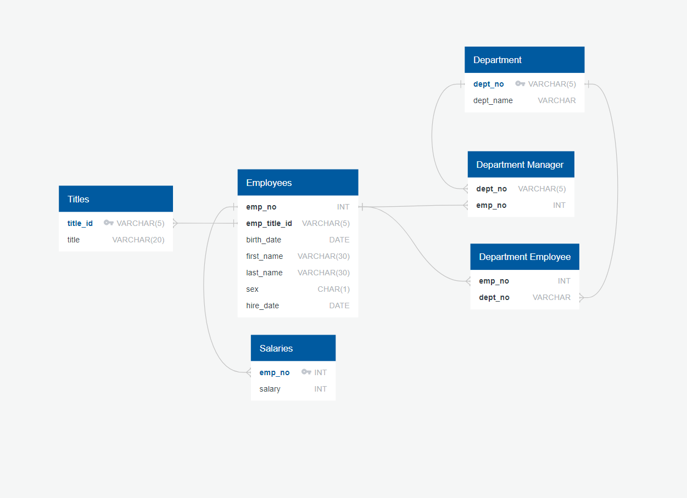

# SQL-challenge

# Description
This is a database of employees in a corporation who worked during the 1980s and 1990s. 

# Data Modeling
### Entity Relationship Diagram
The employee_erd.png displays the relationship and structures of tables in this database. (This ERD was sketched using QuickDBD)

# Data Engineering 

# Data Analysis 